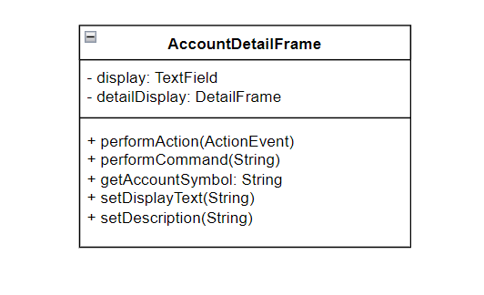
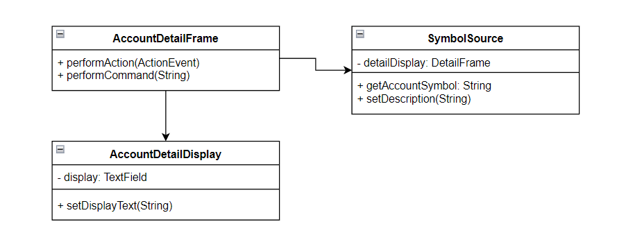

# 10장 테스트 하네스에서 이 메소드를 실행할 수 없다

대부분의 경우, 클래스 생성은 시작에 불과하다. 그 다음 단계는 변경 대상 메소드를 위한 테스트 루틴의 작성이다. 

대체로 메소드에 대한 테스트 루틴을 작성하기 위해 필요한 작업량은 그리 많지 않다. 이 과정에서의 문제는 다음과 같다.
- 메소드를 테스트 루틴에서 접근할 수 없는 경우, 메소드가 private으로 선언됐거나 그밖의 가시성 문제가 있는 경우다.
- 메소드 호출에 필요한 매개변수를 생성하기 어려워서 메소드를 호출하기 어려운 경우
- 메소드의 부정적인 부작용 때문에 테스트 하네스 안에서 실행 불가능한 경우
- 메소드가 사용하는 객체들을 사전에 감지해야 하는 경우


## 숨어있는 메소드 

클래스 내의 메소드를 변경해야 하는데 그 메소드가 private 메소드일 경우 어떻게 해야 할까?


먼저 public 메소드를 통해 테스트 가능할지 검토해보고 가능하다면 public 메소드를 이용해서 테스트한다.

private 메소드를 위한 테스트 루틴은 어떻게 작성하는 것이 좋을까? 

private 메소드를 테스트해야 한다면 그 메소드를 public으로 만들어야 한다는 것이다. 이것이 꺼려진다면 이는 곧 클래스가 너무 많은 책임을 갖고 있음을 의미하며, 따라서 클래스를 수정해야 함을 뜻한다. 

### private 메서드를 public 으로 만드는 것을 고민하게 만드는 이유
1. 이 메소드는 단지 유틸리티다. 즉 호출 코드는 이 메소드를 신경쓰지 않는다. 
  - 클래스의 인터페이스에 추가적인 public 메소드의 존재를 허용할수 있다. 

2. 호출 코드에서 이 메소드를 직접 사용하느 경우, 클래스의 다른 메소드의 결과값에 영향을 미칠수 있다.
  - private 메소드를 신규 클래스로 옮긴 후 public으로 만들고 기존 클래스에서 신규 클래스의 인스턴스를 생성해서 사용한다.

좋은 설계는 테스트 가능한 설계이며, 테스트 불가능한 설계는 나쁜 설계이다. (신규 클래스로 옮기는 것 : 20장 참고)


```typescript
class CCAImage {
  private setSnapRegion(x: number, y:number, dx:number, dy:number):void {}
  public snap(): void {}
}
```

위의 코드는 카메라 시스템에 사용된다.  
public snap 메서드가 호출하는 setSnapRegion 메소드에서 변경해야 하는 상황이 생겼다. 

한 가지 가능한 방법은 setSnapRegion()을 public으로 선언하는 것이다. 하지만 이럴 경우 snap() 메소드 외부에서 setSnapRegion() 메소드를 호출해서 해당 카메라 기록 시스템에 심각한 문제를 일으킬수 있다. 

이미지 클래스를 제대로 테스트할 수 없는 이유는 바로 이 클래스가 너무 많은 책임을 갖고 있기 때문이다. 20장의 기법을 통해 작은 클래스들로 나눈것이 좋지만 당장 대규모 리팩토링을 해야 하는지는 신중한 검토가 필요하다. 전체 프로젝트 단계 중 어느 단계인지, 일정은 어떠한지, 위험요소 등을 따져봐야 한다. 

당장 클래스의 책임을 분할할 수 없는 경우에도 변경 대상 메소드에 대한 테스트 루틴은 어떻게 작성할 수 있을까? 

```typescript
// protected로 변경
class CCAImage {
  protected setSnapRegion(x: number, y:number, dx:number, dy:number):void {}
  public snap(): void {}
}

// 메소드에 접근하기 위한 서브 클래스를 생성
class TestingCCAImage extends CCAImage {
  public setSnapRegion(x: number, y:number, dx:number, dy:number):void {
    super.setSnapRegioin(x, y, dx, dy);
  }
}
```

이렇게 해도 메소드를 protected로 변경해서 하는 것이기 때문에 캡슐화를 위반했고, 서브클래스 내에서 호출될 수 있음을 고려해야 한다. 

> **접근 보호 파괴**
> C++ 이후의 객체지향 언어들은 실행 중에 리플렉션이나 특별한 권한을 통해 private 변수에 접근할 수 있다. 하지만 이는 속임수에 가깝다. 의존 관계 제거에 매우 효과적이지만, 프로젝트의 어디서나 이런식으로 private 변수에 접근하는 테스트를 실행하는 것은 그다지 권장하지 않는다. 이런 종류의 속임수는 코드 품질의 저하를 팀 차원에서 알아차리기 어렵게 만들기 때문이다. 레거시 코드로 작업할 때 느끼는 고통은 코드 개선을 자극하는 긍정적인 효과가 있다. 그런데 속임수를 쓰면 당장은 일이 진행될지 모르지만, 과도한 책임을 가진 클래스와 뒤엉킨 의존 관계라는 근본 원인을 해결하지 않고 뒤로 미루게 된다. 코드가 얼마나 조악한지 모든 사람들이 알게 됐을 때는 이미 코드 개선에 드는 비용이 매우 커져 있을 수도 있다. 

## 언어의 편리한 기능

C#의 sealed, 자바의 fainal 은 서브클래스를 정의할 수 없다. 따라서 테스트코드를 위한 서브클래스화도 불가능하다. 이러한 경우 테스트 루틴은 어떻게 작성해야 할까?

상황마다 다르지만, 해당 sealed 클래스의 슈퍼 클래스를 확인하고 이것을 서브클래스화해서 메소드에 전달하고 이것을 테스트에 활용할 수 있을 것이다.

```c#
public void LList getKSRStreams(OurHttpFileCollection files) {
  ArrayList list = new ArrayList();
  foreach(string name in files) {
    HttpPostedFile file = files[name];
    if(file.FileName.EndsWith(".ksr") || (file.FileName.EndsWith(".txt") && file.ContentLength > MAX_LEN)) {
      // ...
      list.Add(file.InputStream);
    }
  }
  return list;
}
```

위의 코드에서 HttpPostedFiles 객체가 필요한데 이 객체를 생성할수 없을때는 어떻게 할까?
HttpPostedFiles 객체에서 우리가 실제로 필요한 것은 FileName과 ContentLength 이 2개의 속성을 제공하는 클래스가 필요하다.
HttpPostedFile 클래스를 분기하기 위해 API Warpping 기법을 사용할 수 있다.

```c#
public class FakeHttpPostedFile : IHttpPostedFile {
  public FakeHttpPostedFile(int length, Strea stream, ...) {}
  public int ContentLength {
    get {return length;}
  }
}

// =================

public void LList getKSRStreams(OurHttpFileCollection files) {
  ArrayList list = new ArrayList();
  foreach(string name in files) {
    // 인터페이스로 수정했다.
    IHttpPostedFile file = files[name];
    if(file.FileName.EndsWith(".ksr") || (file.FileName.EndsWith(".txt") && file.ContentLength > MAX_LEN)) {
      // ...
      list.Add(file.InputStream);
    }
  }
  return list;
}
```
IHttpPostedFile 인터페이스 구현체이기만 하면 getKSRStreams에서 실행이 가능하게 변경되었다. 

이 방법의 단점은 배포 코드에 원래의 HttpFileCollection코드를 순회하면서 그 안에 포함된 각각의 HttpPostedFile를 wrapping 한 후, 그것을 getSKRStreams 메소드에 전달되는 컬렉션에 추가해야 한다는 점이다. 

sealed와 final 클래스가 잘못이 아니다. 제어 범위를 벗어난 라이브러리에 직접 의존해서 어려움을 스스로 초래한 것이다.

sealed 및 final 클래스가 필요할 때 향후 수월하게 변경하기 위해 wrapper로 분리해두는 것이 바람직하다. (14, 15장 참조)


## 탐지 불가능한 부작용

프로그램은 자체적인 기반 위에서 구축된다. 가끔 값을 반환하지 않는 메소드를 갖는 객체들이 있는데, 이런 메소드를 호출하면 어떤 작업이 수행되겠지만 호출코드는 구체적인 작업내용을 결코 알 수 없다. 객체가 다른 객체의 메소드를 호출했지만 어떤 결과가 나왔는지 알수 없는 것이다.

```typescript
class AccountDetailFrame extends Frame implements ActionListener, WindowListener {
  private display:TextField = new TextField(10);

  constructor(...) {
    ...
  }

  public actionPerformed(event: ActionEvent): void {
    const source = event.getActionCommand() as string

    if(source === "project activity") {
      
      const detailDisplay = new DetailFrame();
      detailDisplay.setDescription(this.getDetailText() + " " + this.getProjectionText());
      detailDisplay.show();

      let accountDescription:string = this.detailDisplay.getAccountSynbol();
      accountDescription += ": ";
      
      // ...
      this.display.setText(accountDescription)
      // ...
    }
  }
}

```

테스트 하네스 내에서 이 메소드의 실행을 시도할 수는 있지만 별 의미는 없다. 이 메소드는 윈도우를 생성하고 이를 화면에 띄우며, 입력 값을 요구하는 프롬프트를 보여주고 다른 윈도우에 무언가를 표시한다. 그중에서 코드가 무슨 일을 하는지 탐지할 수 있는 부분은 없다. 

이런 경우 GUI로부터 독립적인 부분과 GUI에 의존적인 부분을 분리하는 것부터 시작하자.
먼저 메소드 추출 기법을 통해 메소드의 처리내용을 분리해야 한다. 

이 메소드 자체는 윈도우 프레임워크로부터 받은 통지에 대한 훅 함수이다. 가장 먼저 할일은 전달받은 ActionEvent로부터 명령의 이름을 얻는 것이다. 
메소드 본문 전체를 추출하면 ActionEvent 클래스에 대한 의존을 전부 분리할 수 있다. 


```typescript

class AccountDetailFrame extends Frame implements ActionListener, WindowListener {
  private display:TextField = new TextField(10);

  constructor(...) {
    ...
  }

  public actionPerformed(event: ActionEvent): void {
    const source = event.getActionCommand() as string
    // 메소드 본문 전체를 추출하면 ActionEvent 클래스에 대한 의존을 전부 분리할 수 있다. 
    this.performCommand(source)
  }

  public performCommand(source: string): void {
    if(source === "project activity") {
      
      const detailDisplay = new DetailFrame();
      detailDisplay.setDescription(this.getDetailText() + " " + this.getProjectionText());
      detailDisplay.show();

      let accountDescription:string = this.detailDisplay.getAccountSynbol();
      accountDescription += ": ";
      
      // ...
      this.display.setText(accountDescription)
      // ...
    }
  }
}
```

그 다음은 프레임에 접근하는 코드를 메소드로 추출하는 것이다. 이를 위해서 detailDisplay 변수를 이 클래스의 인스턴스 변수로 만드는 것이 좋다. 


```typescript

class AccountDetailFrame extends Frame implements ActionListener, WindowListener {
  private display:TextField = new TextField(10);

  // detailDisplay 변수를 이 클래스의 인스턴스 변수
  private detailDisplay: DetailFrame | undefined;

  constructor(...) {
    ...
  }

  public actionPerformed(event: ActionEvent): void {
    const source = event.getActionCommand() as string
    // 메소드 본문 전체를 추출하면 ActionEvent 클래스에 대한 의존을 전부 분리할 수 있다. 
    this.performCommand(source)
  }

  public performCommand(source: string): void {
    if(source === "project activity") {
      
      this.detailDisplay = new DetailFrame();
      this.detailDisplay.setDescription(this.getDetailText() + " " + this.getProjectionText());
      this.detailDisplay.show();

      let accountDescription:string = this.detailDisplay.getAccountSynbol();
      accountDescription += ": ";
      
      // ...
      this.display.setText(accountDescription)
      // ...
    }
  }
}
```

이제 프레임을 사용하는 코드를 일련의 메소드들로 추출할 수 있게 되었다. 
추출된 코드는 화면 표시 컴포넌트를 사용하고 있지만, 그 사실을 이름으로 드러낼 필요는 없다. 이런 점들을 명심하면서 각 코드마다 명령 메소드, 쿼리 메소드를 작성한다. 

> **명령과 쿼리의 분리**
> 명령과 쿼리 분리는 버트란드 메이어가 처음 제시한 설계 원칙이다. 
> 하나의 메소드는 명령이거나 쿼리여야 하며 두 가지 기능을 모두 가져서는 안 된다. 명령은 객체의 상태를 변경할 수 있지만 값은 반환하지 않으며 쿼리는 값을 반환하지만 객체를 변경하지 않는다. 
> 이 원칙이 중요한 이유 중 가장 중요한 것은 의사소통이다. 어떤 메소드가 쿼리 메소드라면, 연속적으로 이 메소드를 호출해도 부작용이 발생하지 않는 다는 것을 메소드 본문을 확인하지 않고도 알 수 있다.

```typescript

class AccountDetailFrame extends Frame implements ActionListener, WindowListener {
  private display:TextField = new TextField(10);

  // detailDisplay 변수를 이 클래스의 인스턴스 변수
  private detailDisplay: DetailFrame | undefined;

  constructor(...) {
    ...
  }

  public actionPerformed(event: ActionEvent): void {
    const source = event.getActionCommand() as string
    // 메소드 본문 전체를 추출하면 ActionEvent 클래스에 대한 의존을 전부 분리할 수 있다. 
    this.performCommand(source)
  }

  // 커맨드 메소드 분리 
  public setDescription(description:string) {
    this.detailDisplay = new DetailFrame();
    this.detailDisplay.setDescription(description);
    this.detailDisplay.show();
  }

  // 쿼리 메소드 분리
  public getAccountSymbol() {
    return this.detailDisplay.getAccountSymbol();
  }

  public performCommand(source: string): void {
    if(source === "project activity") {
      
      this.setDescription(this.getDetailText() + " " + this.getProjectionText());
      

      let accountDescription:string = this.getAccountSymbol()
      accountDescription += ": ";
      
      // ...
      this.display.setText(accountDescription)
      // ...
    }
  }
}
```

detailDisplay 프레임과 연관된 모든 코드를 추출했으니 이제 AccountDetailFrame의 컴포넌트에 접근하는 코드를 추출할 수 있다. 

```typescript

class AccountDetailFrame extends Frame implements ActionListener, WindowListener {
  private display:TextField = new TextField(10);

  // detailDisplay 변수를 이 클래스의 인스턴스 변수
  private detailDisplay: DetailFrame | undefined;

  constructor(...) {
    ...
  }

  actionPerformed(event: ActionEvent): void {
    const source = event.getActionCommand() as string
    // 메소드 본문 전체를 추출하면 ActionEvent 클래스에 대한 의존을 전부 분리할 수 있다. 
    this.performCommand(source)
  }

  // 커맨드 메소드 분리 
  setDescription(description:string) {
    this.detailDisplay = new DetailFrame();
    this.detailDisplay.setDescription(description);
    this.detailDisplay.show();
  }

  // 쿼리 메소드 분리
  getAccountSymbol() {
    return this.detailDisplay.getAccountSymbol();
  }

  // AccountDetailFrame의 컴포넌트에 접근하는 코드를 추출
  setDisplayText(description:string) {
    this.display.setText(description);
  }

  public performCommand(source: string): void {
    if(source === "project activity") {
      
      this.setDescription(this.getDetailText() + " " + this.getProjectionText());
      

      let accountDescription:string = this.getAccountSymbol()
      accountDescription += ": ";
      
      // ...
      this.setDisplayText(accountDescription)
      // ...
    }
  }
}
```

이러한 추출이 모두 끝나고 나서야 비로소 서브 클래스화와 메소드 재정의 기법을 적용해 performCommand 메소드 내에 남아 있는 코드를 테스트할 수 있다. 예를 들어 AccountDetailFrame을 다음과 같이 서브클래스화하면 project activity 명령이 입력됐을 때 화면에 적절한 텍스트가 표시되는지 검증할 수 있다.

```typescript
class TestingAccountDetailFrame extends AccountDetailFrame {
  displayText:string = "";
  accountSymbol:string = ""

  setDescription(string description):void {}

  getAccountSymbol(): string {
    return accountSymbol;
  }

  setDisplayText(text:string): void {
    this.displayText = text;
  }
}


it("testPerformCommand()", () => {
  const frame = new TestingAccountDetailFrame();
  frame.accountSymbol = "SYM";
  frame.performCommand("project activity");
  expect(frame.displayText).toEqual("SYM: basic account"); // 예시이니 적절히 보완해서 이해하자
});
```

여기까지 왔으면 아래와 같은 구조로 클래스가 만들어진다. 



getAccountSymbol 메소드와 setDescription 메소드는 detailDisplay 변수만을 사용한다.   
setDisplayText 메소드는 display ㅏㄹ는 이름의 TextField 클래스만 사용한다.    
이 메소드들은 별도의 책임을 갖고 있는 것이다. 이것을 리팩토링하면 아래와 같은 구조를 얻을수 있다.



책임은 어느정도 분리시켰다. 

AccountDetailFrame은 GUI와 밀접한 관계가 있고 비즈니스 로직도 포함하고 있다. 지금 상태로도 테스트 케이스 내에서 비즈니스 로직을 포함한 메소드를 실행 할 수 있다. 

SymbolSource 클래스는 다른 Frame 클래스를 작성하고 그로부터 정보를 얻어오는 실체 클래스(concrete class) 이다. SymbolSource라는 이름을 사용한 이유는 AccountDetailFrame 관점에서는 필요한 심볼 정보를 얻어오는 것이 중요하기 때문이다. 

IDE, 에디터에 있는 리팩토링 기능도 적절히 활용하자. (메소드 자동 추출 등 )