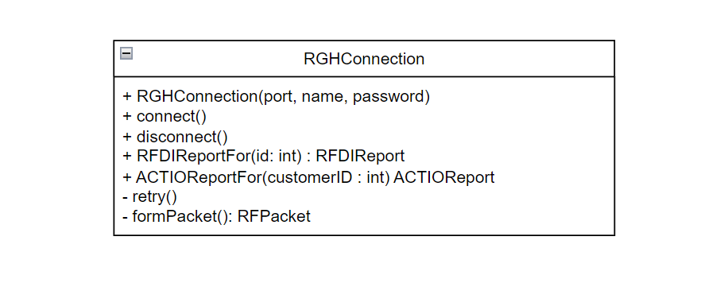
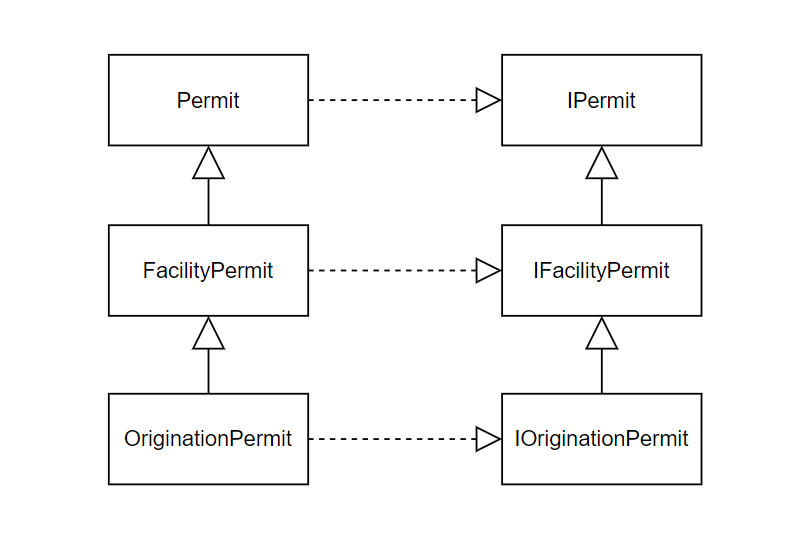

# 9장 뚝딱! 테스트 하네스에 클래스 제대로 넣기

클래스를 테스트 하네스에 넣는 작업의 문제점
1. 클래스의 객체를 쉽게 새성할 수 없다.
2. 클래스를 포함하는 테스트 하네스를 쉽게 빌드할 수 없다.
3. 반드시 사용해야 하는 생성자가 부작용을 일으킨다
4. 생성자의 내부에서 상당량의 처리가 일어나며, 그 내용을 알아내야만 한다. 

## 성가신 매개변수

> 테스트 하네스에서 클래스 인스턴스 생성에 문제가 있을지 알아보는 가장좋은 방법은 일단 시도하는 것이다. 테스트 케이스를 작성하고 객체 생성을 시도하자. 

```typescript
class CreditValidator {
  constructor(
    connection: RGHConnection,
    master: CreditMaster,
    validatorID: string
  ) {
    // ...
  }
  validateCustomer(customer: Customer): Certificate {
    // ...
  }
}

// 객체를 생성하는 테스트이다.
describe("CreditValidator 테스트", () => {
  it("객체 생성테스트", () => {
    // 생성자에 인자가 없으니 컴파일 오류를 발생시킨다. 
    const validator = new CreditValidator();

    // ...
  }
})
```

생성자에 인수가 없어서 에러를 발생한다. 다른 클래스들이 필요하다.            

테스트 단계에서 RGHConnection 객체가 서버와 실제로 연결되는 것은 좋은 생각이 아니다.          
CreditMaster는 생성시 읽기 전용 파일을 신속히 불러올 수 있으니 문제될 것이 없다.          


```typescript
describe("CreditValidator 테스트", () => {
  it("객체 생성테스트2", () => {
    const connection = new RGHConnection(DEFAULT_PORT, "admin", "rii8ii9s");
    const master = new CreditMaster("crm2.mas", true);
    const validatorID = "a";

    const validator = new CreditValidator(connection, master, validatorID);

    // ...
  }
})
```

RGHConnection 클래스에서 인터페이스 추출 기법을 사용하자. 설령 IDE에서 지원하지 않더라도 수작업으로 하면 된다. 




```typescript
class FakeConnection extends IRGHConnection {
  public report: RFDIReport;
  public void connect() {}
  public void disconnect() {}
  public RFDIReportFor(id:number): RFDIReport { return report; }
  public ACTIOReportFor(customerId:number): ACTIOReport { return null as ACTIOReport ; } 
}

// 테스트 루틴
it("testNoSuccess", )_ => {
  const master: CreditMaster = new CreditMaster("crm.mas", true);
  const connection: IRGHConnection = new FakeConnection();
  const validator: CreditValidator = new CreditValidator(connection, master, "a");
  
  connection.report = new RFDIReport(...);
  const result = validator.validateCustomer(new Customer(...));
  expect(result.getStatus()).toEqual(Certificate.VALID);
});
```


테스트 수행을 위해 사용되는 클래스에 적용되는 규칙은 다르다. FakeConnection 내의 코드는 최종 제품에 사용되지 않는다. 완전한 기능을 갖추고 동작하는 애플리케이션에서는 결코 실행될 일이 없으며, 오직 테스트 하네스에서만 사용된다. 

```typescript
// getValidationPercent 
it("testAllPassed100Percent", () => {
  // const master: CreditMaster = new CreditMaster("crm.mas", true);
  const connection: IRGHConnection = new FakeConnection();
  
  // master를 전혀 사용하지 않으니 해당 부분은 null로 전달할 수도 있다.
  // const validator: CreditValidator = new CreditValidator(connection, master, "a");
  const validator: CreditValidator = new CreditValidator(connection, null, "a");
  


  connection.report = new RFDIReport(...);
  const result = validator.validateCustomer(new Customer(...));
  expect(validator.getValidationPercent(), THRESHOLD)
})

``` 

> **테스트 코드 VS 최종 배포 코드**
> 테스트 코드에는 최종적으로 출시되는 배포 코드와 동일한 기준이 적용될 필요가 없다. 테스트 코드를 쉽게 작성하기 위해서라면 public 변수를 정의해서 캡슐화를 위반하는 일도 별 문제는 아니다. 그러나 테스트 코드는 명확해야 한다. 쉽게 이해되고 변경될 수 있어야 한다. 


> **널 값 전달하기**
> 테스트 루틴을 작성할 때, 생성하기 어려운 매개변수를 필요로 하는 객체를 만날 경우 널 값을 전달하는 방법을 고려할 만하다. 이 매개변수가 테스트 수행 중에 사용된다면 코드가 예외를 발생시키므로 테스트 하네스가 포착할 수 있다. 그 객체를 이용하는 테스트가 실제로 필요해지는 시점이 되면, 해당 객체를 생성하고 매개변수로서 넘기도록 코드를 변경하면 된다. 
> 널 값을 전달하는 것은 여러 언어에서 꽤 편리한 기법이다. 자바와 C#등과 같이 실행중의 널ㄹ 값 참조에 대해 예외를 발생시키는 거의 모든 언어에서 활용할 수 있다. 다만 널 포인터 오류를 감지하지 못하는 C, C++에서는 활용할 수 없다.

불가피한 경우가 아니라면 최종 배포 코드에서는 널 값을 전달하면 안된다. 널 객체 패턴은 좋은 대안의 하나이다.

### 널 객체 패턴
널 객체 패턴은 프로그램에서 널 값 사용을 막을 수 있는 방법이다. 

```typescript
// 전달받은 사원 번호를 갖는 사원이 존재하지 않을 경우 어떤 값을 반환해야 할까?

for(const id of idList) {
  const e: Employee = finder.getEmployeeForID(id);
  e.pay();
}

```

- 예외를 발생시켜 아무것도 반환하지 않을수 있다. 이렇게 하면 호출을 수행한 코드에서 반드시 오류를 처리하도록 강제하는 것이 된다. 
- null값을 반환할수도 있지만, 호출코드에서 반드시 null검사를 수행해야 한다. 
- NullEmployee라는 이름의 널 객체를 활용할 수 있다. 급여를 처리할 때 아무 일도 하지 않는다. 호출 코드에서 명시적으로 오류 처리를 하지 않아도 된다. 하지만 전체 객체 카운트 하는 식의 경우에 대해서는 좋지 않다. 

```typescript
 
for(const id of idList) {
  const e: Employee = finder.getEmployeeForID(id);
  e.pay();
  employeeCount++;  // null객체 반환으로 인해 에러 발생하지 않아서 계속 카운트 되는 버그 발생
}

```

널 전달과 인터페이스 추출은 성가신 매개변수 문제를 해결할 수 있는 기법들이다.         
또한 매개변수와 관련된 의존관계가 생성자 내에 하드코딩되어 있지 않다면, 서브 클래스 생성과 메서드 재정의를 통해 의존 관계를 제거할 수 있다. 

## 숨겨진 의존 관계

생성자를 처리할 때 테스트 하네스 내에서 쉽게 접근할 수 없는 자원을 사용하는 경우에 나타나기 쉽다.


```c++
class mailing_list_dispatcher
{
public:
  mailing_list_dispatcher();
  virtual ~mailing_list_dispatcher;

  void send_message(const std::string& message);
  void add_recipient(const mail_txm_id id, const mail_address& address);

private:
  mail_service *service;
  int status;
}

// 생성자 초기화 목록에서 new를 사용해 mail_service객체를 할당하는데 좋은 방법이 아니다.
// 생성자는 mail_service에 대해 몇 가지 작업을 수행하고, 매직넘버 12eh tkdydgkrh dlTek. 

mailing_list_dispatcher::mailing_list_dispatcher() : service(new mail_service), status(MAIL_OKAY)
{
  const int client_type = 12;
  service->connect();
  if(service->get_status() == MS_AVAILABLE) {
    service->register(this, client_type, MARK_MESSAGES_OFF);
    service->sert_param(client_type, ML_NOBOUNCE | ML_REPEATOFF);
  } else {
    status = MAIL_OFFLINE;
    ....
  }
}
```

위와 같은 코드는 테스트를 위해 메일 라이브러리에 연결, 등록 처리를 위해 메일 시스템을 설정해야 한다.     
자동화된 테스트를 구현하려면 특정한 편지함을 설정하고 반복적으로 이 편지함에 연결해서 메세지가 수신되기를 기다려야 하는 것이다.      

어떻게 객체를 간단히 만들 수 있을까? 

여기서 근본적인 문제는 amil_service에 대한 의존 관계가 mailing_list_dispatcher의 생성자 내부에 숨어있다는 점이다. 가짜 amil_service 객체를 생성할 수 있다면 이 가짜 객체를 통해 어떤 식으로든 피드백을 받을 수 있다. 

이때 사용할수 있는 기법 중 하나가 **생성자 매개변수화 기법**이다. 이 기법을 사용해 amil_service 객체를 생성자에 전달해서 생성자 내부의 의존 관계를 밖으로 드러낼 수 있다.

```c++
// mail_service 객체를 클래스 외부에서 생성한후 전달해준다. 
mailing_list_dispatch::mailing_list_dispatcher(mail_service *service): status(MAIL_OKAY)
{
  const int client_type = 12;
  service->connect();
  if(service->get_status() == MS_AVAILABLE) {
    service->register(this, client_type, MARK_MESSAGES_OFF);
    service->set_param(client_type, ML+NOBOUNCE | ML_REPEATOFF);
  } else {
    status = MAIL_OFFLINE;
  }
}
```

인터페이스 추출 기법을 사용해 mail_service의 인터페이스를 정의할 수 있게 되었다. 이 인터페이스를 구현하는 클래스 중 하나는 실제로 메일을 보내는 배포 버전용 클래스로 하고, 다른 하나는 가짜 클래스로 해서 테스트 실행 결과를 조사하고 내용을 확실히 파악할 수 있다. 

생성자 매개변수화 기법은 생성자의 의존 관계를 외부화하는 쉬운 방법이다. 만약 새롭게 추가된 매개변수를 전달하기 위해서는 어떻게 하면 될까? 이런 경우 우선 생성자의 본문을 initialize등의 이름을 갖는 메소드로 이동한다. 그다음 생성자에서는 내부적으로 initailize를 호출하면 된다. 

```c++
mailing_list_dispatch::initialize(mail_service *service)
{
  status = MAIL_OKAY;
  const int client_type = 12;
  service->connect();
  if(service->get_status() == MS_AVAILABLE) {
    service->register(this, client_type, MARK_MESSAGES_OFF);
    service->set_param(client_type, ML+NOBOUNCE | ML_REPEATOFF);
  } else {
    status = MAIL_OFFLINE;
  }
}

mailing_list_dispatch::mailing_list_dispatcher(): status(MAIL_OKAY)
{
  initialize(new mail_service); 
}
```

c#이나 자바 같은 언어는 생성자에서 다른 생성자를 호출할 수 있어서 더 쉽다. 

생성자 내에 숨어있는 의존 관계는 여러 기법을 활용해 해결될 수 있다. 
- get 메서드 추출과 재정의
- 팩토리 메소드 추출과 재정의
- 인스턴스 변수 대체 등
- 생성자 매개변수화 기법 

## 복잡한 생성자

생성자 내부에서 많은 수의 객체가 생성되거나 많은 수의 전역 변수에 접근하는 경우, 매개변수 목록의 크기가 지나치게 커질수 있다. 생성자 내부에서 몇개의 객체를 생성한 후 이 객체들을 다시 다른 객체를 생성하는데 사용하는 경우도 있다. 

```typescript
class WatercolorPane {
  constructor(border:Form, brush:WashBrush, backdrop:Pattern) {
    // ...
    this.anteriorPanel = new Panel(border);
    this.anteriorPanel.setBorderColor(brush.getForeColor());
    this.backgroundPanel = new Panel(border, backdrop);
    this.cursor = new FocusWidget(brush, this.backgroundPanel);
    // ...
  }
}
```

이런 경우 **인스턴스 변수 대체 기법**을 사용할 수 있다. 객체를 생성한 후에 다른 인스턴스로 대체하기 위한 set메소드를 클래스에 추가하는 기법이다. 

```typescript
class WatercolorPane {
  constructor(border:Form, brush:WashBrush, backdrop:Pattern) {
    // ...
    this.anteriorPanel = new Panel(border);
    this.anteriorPanel.setBorderColor(brush.getForeColor());
    this.backgroundPanel = new Panel(border, backdrop);
    this.cursor = new FocusWidget(brush, this.backgroundPanel);
    // ...
  }
  // 새로운 객체로 대체한다. 
  supersedeCursor(newCursor: FocusWidget) {
    this.cursor = new Cursor;
  }
}
```

C++에서는 이러한 리팩토링 시에 조심해야한다. 기존 객체를 delete 연산자를 사용해 소멸자를 호출하고 메모리로부터 제거해줘야 한다, 그 밖의 언어에서는 대체로 인스턴스 변수 대체 기법을 쉽게 사용할 수 있다. 

WatercolorPane 클래스 외부에서 FocusWidget 객체를 생성하고, 이를 객체 생성 후에 전달하는 것을 시도할 수 있다. 그리고 인터페이스 추출 기법이나 구현체 추출 기법을 FocusWidget 클래스에 적용하고, 가짜 객체를 생성해 전달해서 감지 작업을 수행할 수 있다. 

```typescript
it("renderBorder Test", () => {
  const widget = new TestingFocusWidget();
  const pane = new WatercolorPane(form, border, backdrop);

  pane.supersedeCursor(widget);

  expect(pane.getComponentCount()).toEqual(0);
})
```

## 까다로운 전역 의존 관계

테스트 프레임워크에서 클래스 생성 및 사용을 ㅓㅇ렵게 만드는 다양한 의존 관계들이 있다. 그중에서도 가장 까다로운 것이 전역 변수의 사용이다. 전역 변수와 관련된 의존 관계는 너무 광범위하기 때문에 문제의 근원을 찾아서 해결하는 것이 오히려 쉬울 때가 많다. 

```typescript
class Facility {
  private basePermit:Permit;

  constructor(facilityCode:number, owner:string, notice:PermitNotice) {
    const associatedPermit = PermitRepository.getInstance().findAssociatedPermit(notice);

    if(associatedPermit.isValid() && !notice.isValid()) {
      this.basePermit = associatedPermit;
    } else if(!notice.isValid()) {
      const permit = new Permit(notice);
      permit.validate();
      this.basePermit = permit;
    } else {
      throw new PermitViolation(permit);
    }
  }
}

it("testCreate", () => {
  const notice = new PermitNotice(0, "a");
  const facility = new Facility(Facility.RESIDENCE, "b", notice);
})

```

아래 코드는 싱글톤 패턴에 해당된다. 
```typescript
PermitRepository.getInstance().findAssociatedPermit(notice);
```
싱글톤 패턴은 자바에서 전역 변수를 사용하기 위한 방법 중 하나이다. 일반적으로 전역변수는 바람직하지 않은 것으로 간주되는데 그 이유는 투명하지 않다는 점이다. 프로그램내에 어떤 변수에 접근, 변경했는지 알수 없어서 이해하기 어렵게 만든다. 

PermitRepository는 싱글톤이다. 따라서 가짜 객체를 생성하기가 꽤 까다롭다. 따라서 가짜 객체를 생성하기가 꽤 까다롭다. 싱글톤 패턴의 원래 목적은 애플리케이션 내에서 두 개 이상의 싱글톤 인스턴스 생성을 허용하지 않는 것이다. 배포코드에서는 좋은 일이지만, 테스트 코드에서는 테스트 집합 내의 각 개별 테스트 루틴을 하나의 작은 애플리케이션으로 볼 수 있기 때문에 문제가 된다. 각각의 테스트 루틴은 다른 것과 완전히 독립돼야 한다. 

다음은 싱글톤 제약을 풀어주는 방법이다.    

먼저 싱글톤 클래스에 새로운 정적 메소드를 추가한다. 이 메소드는 싱글톤의 정적 인스턴스를 대체하는 역할을 한다. (setTestingInstance)

```typescript
class PermitReponsitory {
  private static instance: PermitReponsitory | null = null;

  private constructor() {}

  public static setTestingInstance(newInstance: PermitRepository) {
    this.instance = newInstance;
  }

  public static getInstance(): PermitRepository {
    if(this.instance === null) {
      this.instance = new PermitRepository();
    }
    return this.instance;
  }
  // ...
}
```
다음과 같이 테스트를 위한 함수를 만들었다. 

```typescript
function TestSetUp() {
  const repository = new PermitRepository();
  // repository에 권한을 부여
  PermitRepository.setTestingInstance(repository);
}
```
싱글톤 디자인 패턴을 사용할 때는 대체로 싱글톤 클래스의 생성자를 private으로 선언하는데, 싱글톤의 또 다른 인스턴스를 클래스 외부에서 생성하지 못하도록 막기 위해서이다. 충돌이 있다. 한 개의 인스턴스만 존재하기 원하는 것과 동시에 시스템 내의 각 클래스들을 독립적으로 테스트할 수 있길 원하는 것이다. 

PermitRepository를 서브클래스화 와 메소드 재정의 기법을 사용해서 싱글톤의 일부 특성을 유지할 수 있다.      
이렇게 하면 PermitRepository를 2개 이상 생성할 수 없다는 특성을 유지하면서 서브클래스의 객체를 2개 이상 생성할 수 있다. 

이 처럼 서브 클래스화와 메소드 재정의 기법을 사용해서 가짜 싱글톤 객체를 생성할수 있다. 하지만 의존 관계가 매우 광범위할 경우에는 싱글톤에 인터페이스 추출 기법을 적용해 애플리케이션 내의 모든 참조를 인터페이스를 사용하도록 변경하는 편이 나을 수도 있다. 


```typescript
class PermitRepository implements IPermitRepository {

  // 인터페이스
  private static IPermitRepository instance = null;

  protected constructor() {}

  // 인터페이스
  public static setTestingInstance(newInstance: IPermitRepository) {
    this.instance = newInstance;
  }

  // 인터페이스
  public static getInstance(): IPermitRepository {
    if(this.instance === null) {
      this.instance = new PermitRepository();
    }
    return this.instance;
  }
  // ...
}

```

이렇게 static set을 이용한 기법을 정적 set 메소드 오비 기법이라고 부른다. 하지만 전역 의존 관계를 제거하는데는 별 도움이 되지 않는다. 전역 의존 관계를 제거하려면 메소드 매개변수화 또는 생성자 매개변수화 기법을 사용하자. 이 기법들을 사용하면 전역 참조를 임시 변수나 객체의 필드로 바꿀 수 있다. 

- 메소드 매개변수화 기법의 단점은 메소드들이 추가되기 때문에 클래스를 이해하는데 방해가 된다는 점이다. 
- 생성자 매개변수화 기법의 단점은 현재 전역 변수를 사용 중인 모든 객체에 필드가 새로 추가된다는 점이다. 

만일 코드 내의 광범위한 위치에서 사용되는 전역 변수가 존재한다면 이는 코드가 적절히 계층화되지 않았음을 의미한다.


## 공포스러운 인쿨루드 의존 관계

c++의 include 관련 내용이라 패쓰

## 양파껍질 매개변수

모든 객체는 이후의 처리를 제대로 처리할 수 있도록 적절한 상태로 설정되어 있어야 한다. 이렇게 되려면 적절히 설정된 별도의 객체를 전달받아야 할 때가 많다. 그리고 이 객체의 설정을 위해 또 다른 객체가 필요하고 또 다른 객체가 필요하고... 이른바 양파껍질 과 비슷한 경우가 생긴다. 

```typescript
class SchedulingTaskPane extends SchedulerPane {
  constructor(task: SchedulingTask) {
    // ...
  }
}

class SchedulingTask extends SerialTask {
  constructor(scheduler:Scheduler, resolver:MettingResolver) {

  }
}

new SchedulingTaskPane(
  new SchedulingTask(
    new Scheduler(
      // ...
    ) , 
    new MettingResolver(
      // ...
    )
  )
)
```

이러한 상황에 대처하는 방법은 자세히 검토하는 것이다. 테스트 루틴의 관점에서 생성자에게 전달되는 매개변수 중 정말로 필요한 것은 무엇인가? 불필요한 것은 null 전달 기법을 활용할 수 있다. 몇개의 기본적인 동작만 필요하다면 인터페이스 추출, 구현체 추출 기법을 통해 인터페이스를 생성한다. 그 인터페이스를 통한 가짜 개체를 생성할 수 있다. 언어에 따라서는 추상클래스를 활용할 수도 있다. 


## 별명을 갖는 매개변수

```typescript
class IndustrialFacility extends Facility {
  basePermit: Permit;

  constructor(facilityCode: number, owner:string, permit: OriginationPermit) {
    const associatedPermit: Permit = PermitRepository.GetInstance().findAssociatedFromOrigination(permit);

    if(associatedPermit.isValid() && !permit.isValid()) {
      this.basePermit = associatedPermit;
    } else if(!permit.isValid()) {
      permit.validate();
      this.basePermit = permit;
    } else {
      throw new PermitViolation(permit);
    }
  }
}
```
싱글톤 클래스인 PermitRepository에 접근하고 있다.       
생성자에게 전달해야 하는 OriginationPermit 객체를 생성하기가 어렵다.        
OriginationPermit는 복잡한 의존 관계를 갖고 있기 때문이다. 

IndustrialFacility 생성자는 OriginationPermit을 받아서 PermitRepository로부터 관련 Permit을 얻기 위해 PermitRepository의 메소드를 사용한다. 관련 Permit을 발견하면 이를 basePermit 변수에 저장하고, 찾지 못하면 OriginationPermit을 basePermit필드에 저장한다. OriginationPermit의 인터페이스를 ㅅ애성할 수도 잇지만 그다지 도움되지 않는다. IOriginationPermit의 인터페이스 타입을 Permit 타입 필드에 대입해야 하는데, 자바에서는 인터페이스가 클래스를 상속할 수 없으므로 제대로 동작하지 않을 것이기 때문이다. 가장 확실한 해결책은 인터페이스들로만 이뤄진 계층 구조를 생성한 후 Permit필드를 IPermit 필드로 변환하는 것이다. 



인터페이스는 의존 관계 제거에는 효과적이지만 , 클래스와 인터페이스 간의 일대일 관계는 전체 설계에 혼란을 가져온다. 다른 선택지가 있다면 그것부터 검토하는 것이 바람직하다. 

인터페이스 추출 기법은 매개변수의 의존 관계 제거 기법의 하나일 뿐이다. 해당 클래스와의 연결을 그냥 제거하면 될 때도 있다. 문제 되는 일부의 부분만 제거하는 것이다. 

이럴 때에는 서브 클래스화와 메소드 재정의 기법의 사용을 고려할만하다. 서브 클래스를 만들어서 쉽게 변경할 수 있는 메소드를 제공한 후, 서브 클래스에서 재정의된 메소드를 사용해서 문제되는 부분을 변경할 수 있다. 하지만 의존 관계들이 로직과 섞여 있을 때는 메소드 추출을 먼저 수행해야 한다. 


